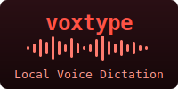
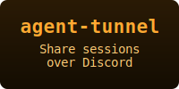
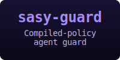
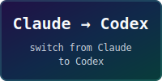

CLI tools, skills, agents, hooks, and plugins for enhancing productivity with Claude Code and other coding agents.

## [Full Documentation →](https://pchalasani.github.io/claude-code-tools/)

Everything — installation, every tool, plugins, and guides — lives in the
docs. Click a card below to jump to a feature, or
**[read the full docs](https://pchalasani.github.io/claude-code-tools/)**.

<table>
<tr>
<td align="center">

</td>
<td align="center">

</td>
</tr>
</table>

<table>
<tr>
<td align="center">

</td>
<td align="center">

</td>
<td align="center">

</td>
</tr>
<tr>
<td align="center">

</td>
<td align="center">

</td>
<td align="center">

</td>
</tr>
<tr>
<td align="center">

</td>
<td align="center">

</td>
<td align="center">

</td>
</tr>
<tr>
<td align="center">

</td>
<td align="center">

</td>
<td align="center">

</td>
</tr>
<tr>
<td align="center">

</td>
<td align="center">

</td>
<td align="center">

</td>
</tr>
<tr>
<td align="center">

</td>
</tr>
</table>

<table>
<tr>
<td align="center">

</td>
<td align="center">

</td>
</tr>
</table>

